# Hi.Events – Instrukcja obsługi

> Wersja: 1.8.0-beta · Środowisko lokalne: https://localhost:8443

---

## Spis treści

1. [Logowanie](#1-logowanie)
2. [Dashboard organizatora](#2-dashboard-organizatora)
3. [Tworzenie wydarzenia](#3-tworzenie-wydarzenia)
4. [Getting Started – pierwsze kroki](#4-getting-started--pierwsze-kroki)
5. [Bilety i produkty](#5-bilety-i-produkty)
6. [Kody promocyjne](#6-kody-promocyjne)
7. [Uczestnicy](#7-uczestnicy)
8. [Zamówienia](#8-zamówienia)
9. [Wiadomości](#9-wiadomości)
10. [Ustawienia wydarzenia](#10-ustawienia-wydarzenia)
11. [Ustawienia konta](#11-ustawienia-konta)
12. [Check-in (odprawa)](#12-check-in-odprawa)
13. [Afiliacje](#13-afiliacje)
14. [Płatności offline i fakturowanie](#14-płatności-offline-i-fakturowanie)

---

## 1. Logowanie

Otwórz **https://localhost:8443/auth/login** w przeglądarce.

> Przy pierwszym otwarciu przeglądarka może wyświetlić ostrzeżenie o niezaufanym certyfikacie SSL.
> Kliknij **Zaawansowane → Przejdź mimo to**, aby kontynuować.

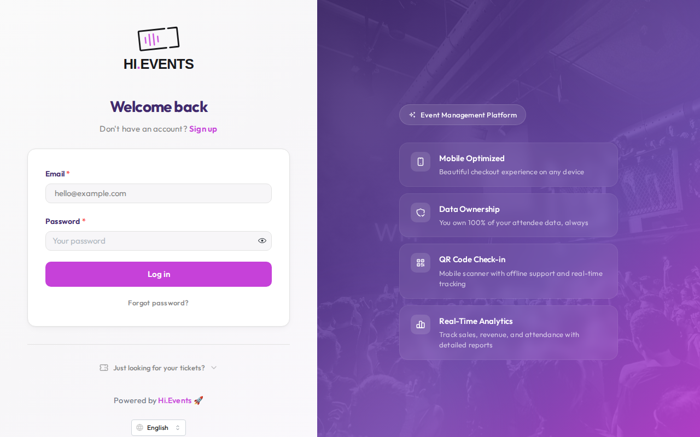

Dane do logowania (konto demo):

| Pole | Wartość |
|------|---------|
| Email | `admin@example.com` |
| Hasło | `Password123!` |

Po zalogowaniu trafisz na **Dashboard organizatora**.

---

## 2. Dashboard organizatora

Po zalogowaniu widzisz główny pulpit z podsumowaniem statystyk:
- Gross Sales, Products Sold, Attendees
- Total Orders, Total Tax, Total Fees
- Lista ostatnich zamówień i nadchodzących wydarzeń

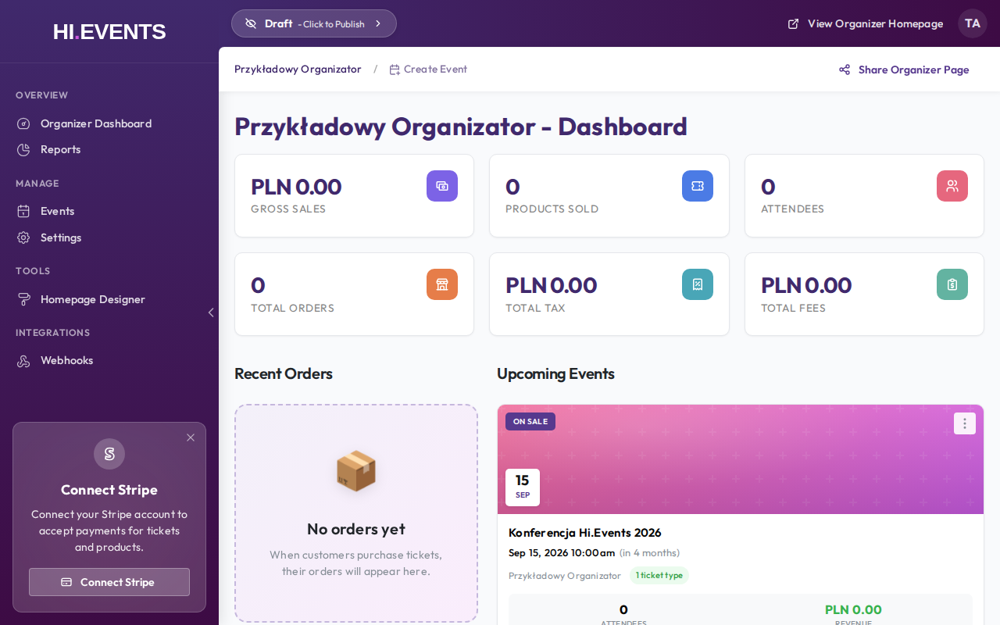

**Menu boczne** (lewy panel):

| Sekcja | Elementy |
|--------|----------|
| OVERVIEW | Organizer Dashboard, Reports |
| MANAGE | Events, Settings |
| TOOLS | Homepage Designer |
| INTEGRATIONS | Webhooks |

Kliknij w kafelek lub nazwę wydarzenia, aby przejść do jego panelu zarządzania.

---

## 3. Tworzenie wydarzenia

Na dashboardzie kliknij przycisk **+ Create Event** (górny prawy róg lub link w breadcrumb).

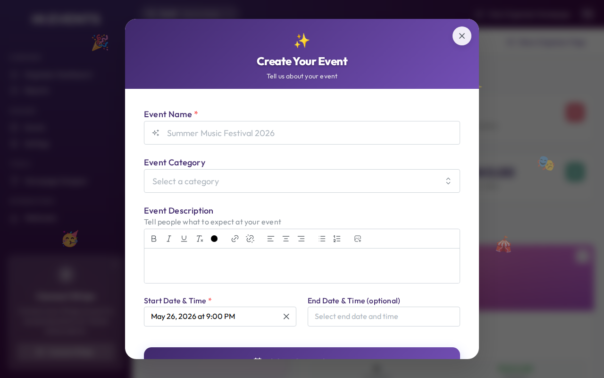

Wypełnij formularz:

| Pole | Opis |
|------|------|
| **Event Name** | Nazwa wydarzenia (wymagane) |
| **Event Category** | Kategoria (np. Tech, Music, Business) |
| **Event Description** | Opis – edytor rich-text |
| **Start Date & Time** | Data i godzina rozpoczęcia (wymagane) |
| **End Date & Time** | Data zakończenia (opcjonalne) |

Kliknij **Next**, by przejść do wyboru organizatora lub zapisać wydarzenie.

Nowe wydarzenie startuje w statusie **DRAFT** (niewidoczne publicznie).

### Cykl życia wydarzenia

```
DRAFT  →  LIVE  →  ARCHIVED
```

Aby opublikować wydarzenie, kliknij pasek statusu **Draft – Click to Publish** na górze strony.

---

## 4. Getting Started – pierwsze kroki

Po wejściu w wydarzenie zobaczysz stronę **Getting Started** z listą kroków do wykonania.

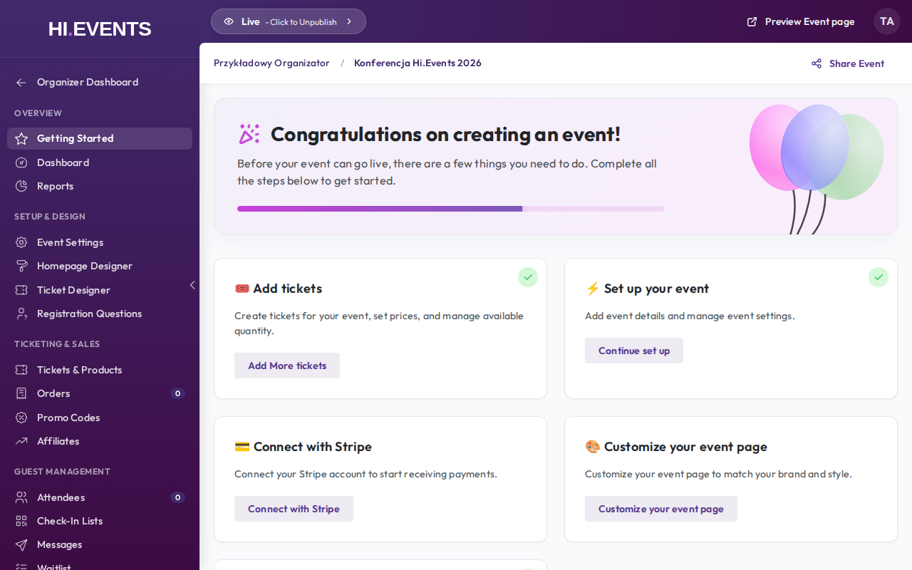

Kroki prowadzą przez:
1. **Add tickets** – utwórz bilety
2. **Set up your event** – uzupełnij szczegóły w Event Settings
3. **Connect with Stripe** – podłącz konto płatności
4. **Customize your event page** – dostosuj stronę publiczną

> Zielony znacznik przy kroku oznacza, że jest ukończony.

---

## 5. Bilety i produkty

Ścieżka: **menu boczne → Tickets & Products**

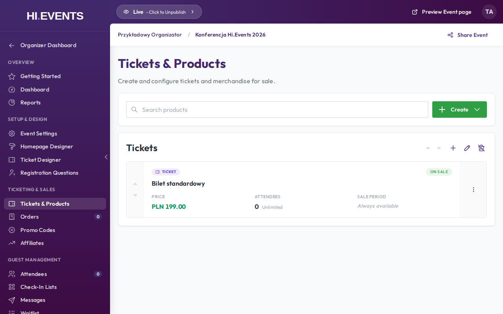

Na liście widać wszystkie bilety z cenami, ilością sprzedaną i okresem sprzedaży.

### Tworzenie nowego biletu

1. Kliknij zielony przycisk **+ Create** (prawy górny róg)

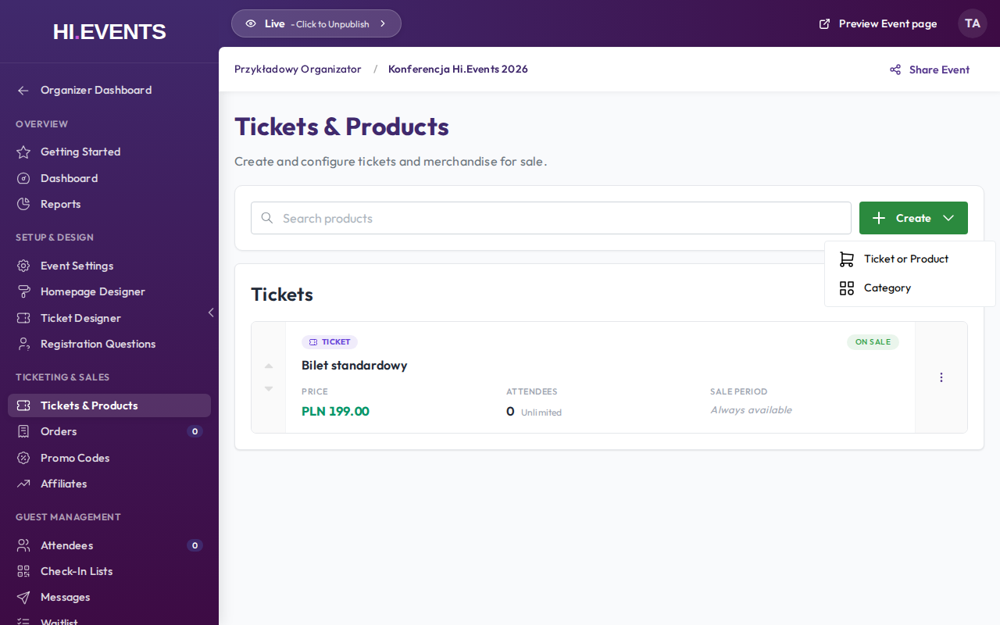

2. Wybierz **Ticket or Product** z menu

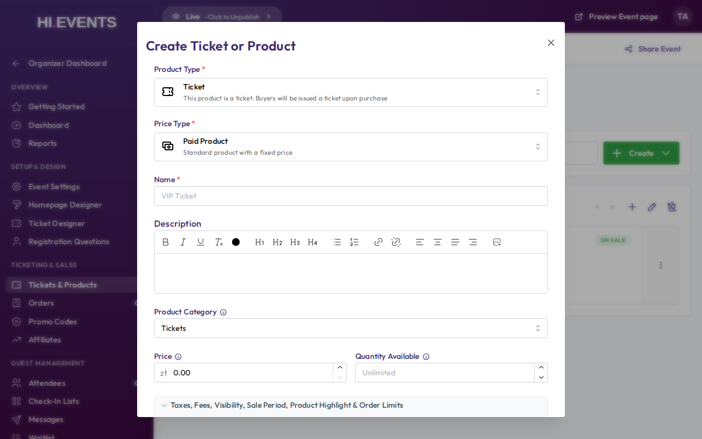

Wypełnij formularz:

| Pole | Opis |
|------|------|
| **Product Type** | `Ticket` (z kodem QR) lub `General` (produkt bez biletu) |
| **Price Type** | `Paid` / `Free` / `Donation` (klient wpisuje kwotę) |
| **Name** | Nazwa biletu (np. „Bilet VIP") |
| **Description** | Opis biletu (edytor rich-text) |
| **Product Category** | Grupowanie na stronie publicznej |
| **Price** | Cena w walucie wydarzenia |
| **Quantity Available** | Limit sztuk (puste = bez limitu) |

### Opcje rozszerzone

Kliknij **Taxes, Fees, Visibility, Sale Period, Product Highlight & Order Limits**, aby rozwinąć dodatkowe ustawienia:

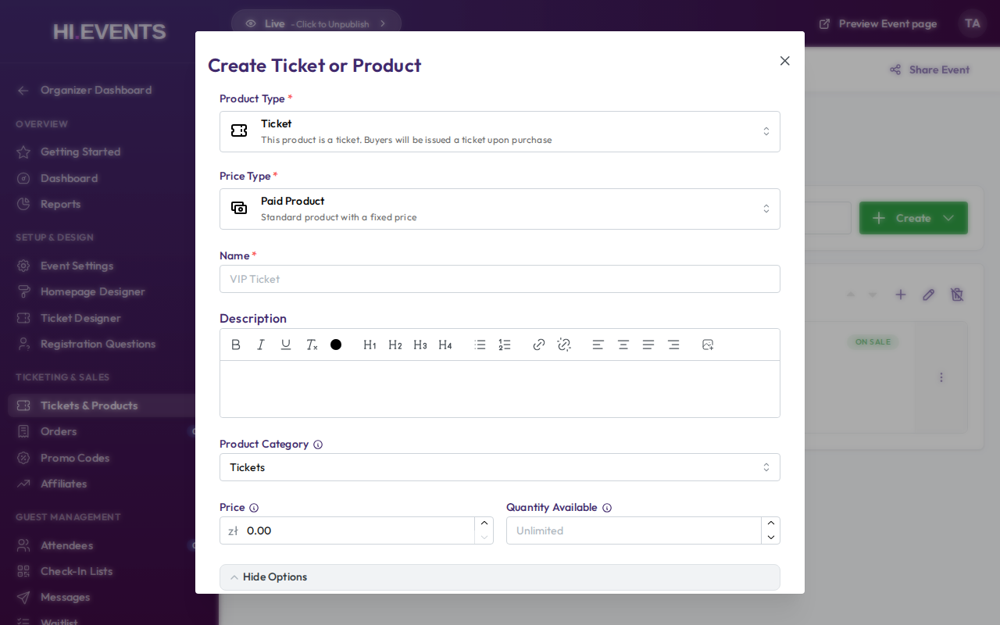

| Opcja | Opis |
|-------|------|
| Taxes & Fees | Przypisz podatki/opłaty serwisowe |
| Sale Period | Data startu i końca sprzedaży |
| Min/Max per order | Limity na jedno zamówienie |
| Hide before sale start | Ukryj bilet przed datą sprzedaży |
| Hide when sold out | Ukryj gdy wyprzedany |
| Hidden without promo code | Bilet widoczny tylko po wpisaniu kodu |
| Show quantity remaining | Pokazuj pozostałą ilość |

Kliknij **Save** (lub **Create Ticket**), aby zapisać.

---

## 6. Kody promocyjne

Ścieżka: **menu boczne → Promo Codes**

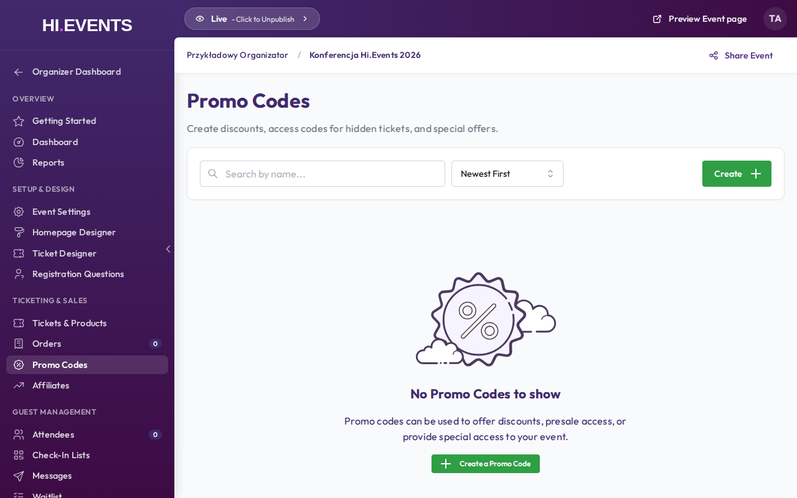

Kliknij **+ Create a Promo Code**, aby stworzyć kod.

| Pole | Opis |
|------|------|
| **Code** | Wpisz własny kod lub kliknij „Generate" |
| **Discount Type** | Brak / Procentowy / Kwotowy |
| **Value** | Wysokość zniżki |
| **Products** | Które bilety obejmuje kod |
| **Expiry Date** | Opcjonalna data ważności |
| **Usage Limit** | Maks. liczba użyć |

> **Wskazówka:** Kod bez zniżki służy wyłącznie do odblokowania biletów ukrytych opcją „Hidden without promo code".

---

## 7. Uczestnicy

Ścieżka: **menu boczne → Attendees**

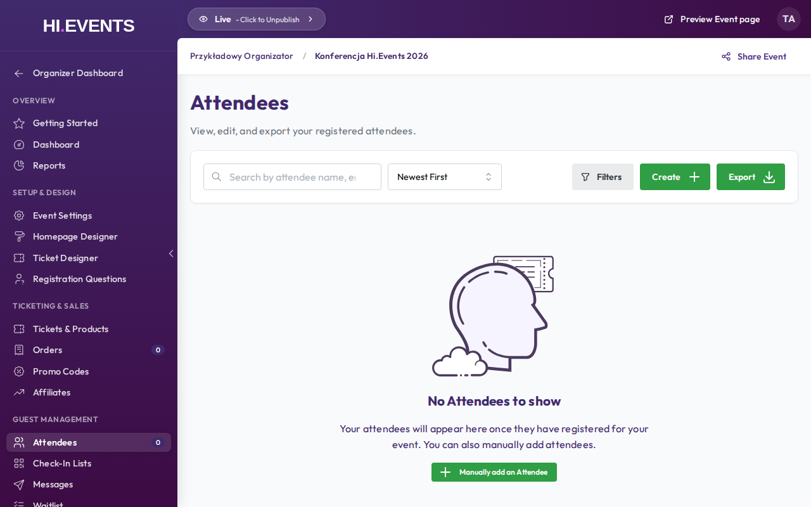

- **Wyszukiwanie** po imieniu, nazwisku, e-mailu lub numerze zamówienia
- **Filtrowanie** po typie biletu i statusie (Active / Cancelled / Awaiting Payment)
- **Export** – przycisk `Export` pobiera plik XLSX

### Ręczne dodanie uczestnika

Kliknij **+ Create**, wypełnij dane (imię, nazwisko, e-mail, typ biletu, kwota) i opcjonalnie zaznacz „Wyślij e-mail z potwierdzeniem".

---

## 8. Zamówienia

Ścieżka: **menu boczne → Orders**

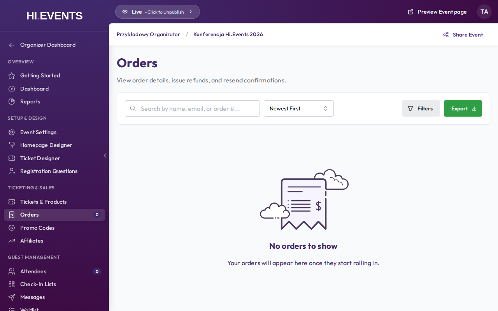

- **Wyszukiwanie** po nazwie, e-mailu lub numerze zamówienia
- **Filtrowanie** po statusie zamówienia i zwrotu
- **Export** – pobiera plik XLSX

### Szczegóły zamówienia

Kliknij w zamówienie, aby otworzyć panel boczny z zakładkami:
- **View** – szczegóły, podsumowanie, pytania i odpowiedzi, uczestnicy
- **Edit** – edycja danych zamawiającego i notatek wewnętrznych
- **Refund** – zwrot pełny lub częściowy (opcja anulowania zamówienia)

---

## 9. Wiadomości

Ścieżka: **menu boczne → Messages**

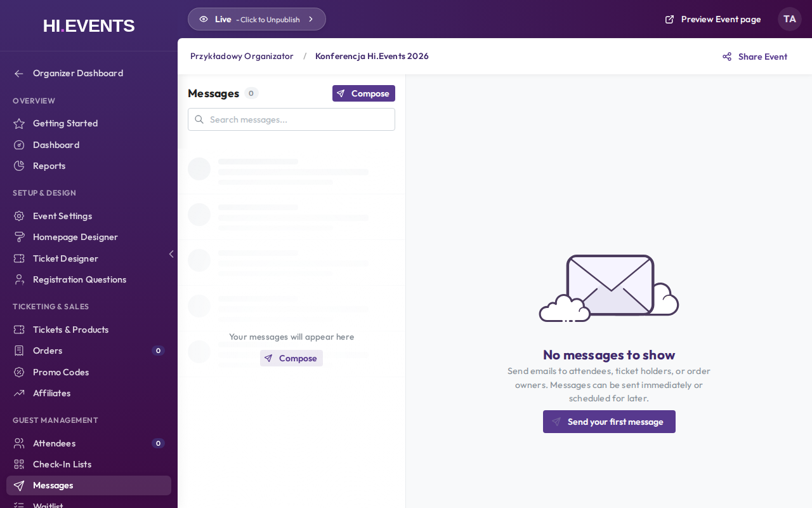

Kliknij **Compose**, aby napisać wiadomość do uczestników.

| Pole | Opis |
|------|------|
| **Recipients** | Wszyscy / z konkretnym biletem / właściciele zamówień |
| **Subject** | Temat e-maila |
| **Body** | Treść (edytor rich-text) |
| **Send time** | Natychmiast lub zaplanowany termin |

Przed wysłaniem zaznacz checkbox potwierdzający charakter transakcyjny wiadomości.

---

## 10. Ustawienia wydarzenia

Ścieżka: **menu boczne → Event Settings**

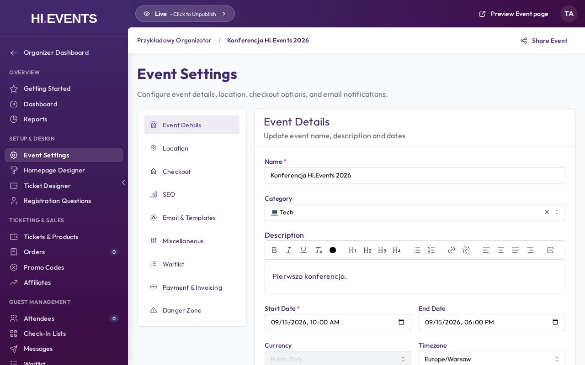

Panel zawiera zakładki:

| Zakładka | Zawartość |
|----------|-----------|
| **Event Details** | Nazwa, kategoria, opis, daty, waluta, strefa czasowa |
| **Location** | Adres fizyczny lub oznaczenie jako online |
| **Checkout** | Komunikaty, czas na zakup, zbieranie danych uczestników |
| **SEO** | Meta title, meta description, Open Graph |
| **Email & Templates** | Nadawca e-maili, szablony wiadomości |
| **Miscellaneous** | Dodatkowe opcje |
| **Waitlist** | Automatyczne zarządzanie listą oczekujących |
| **Payment & Invoicing** | Stripe, płatności offline, faktury |
| **Danger Zone** | Usunięcie lub archiwizacja wydarzenia |

> **Waluta** nie może być zmieniona po zapisaniu pierwszego zamówienia.

---

## 11. Ustawienia konta

Ścieżka: **https://localhost:8443/manage/account/**

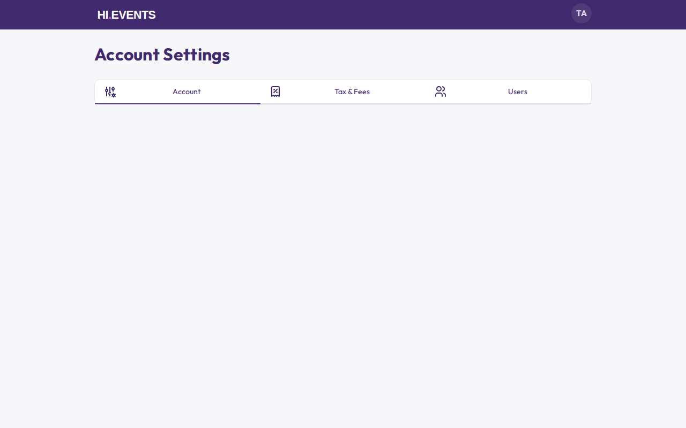

| Sekcja | Opis |
|--------|------|
| **Account Settings** | Nazwa konta, logo, branding |
| **Taxes & Fees** | Globalne podatki i opłaty (przypisywane do biletów) |
| **Event Defaults** | Domyślne ustawienia dla nowych wydarzeń |
| **Users** | Zapraszanie i zarządzanie użytkownikami (role: Admin / Organizer) |
| **Payment** | Podpięcie Stripe Connect |

---

## 12. Check-in (odprawa)

Ścieżka: **menu boczne → Check-In Lists**

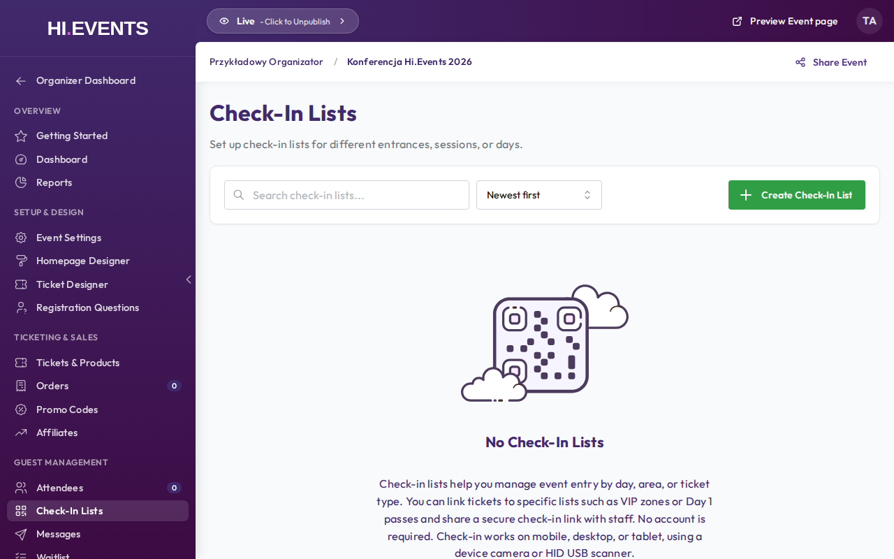

Kliknij **+ Create Check-In List**, aby stworzyć listę odprawy.

| Pole | Opis |
|------|------|
| **Name** | Np. „Wejście główne" / „Strefa VIP" |
| **Tickets** | Które typy biletów obsługuje lista |
| **Activation / Expiry Date** | Okno czasowe skanowania |

Po zapisaniu system generuje **link i kod QR** – udostępnij go obsłudze.
Link `/check-in/{shortId}` nie wymaga logowania do systemu.

Przy skanowaniu biletu:
- ✅ **Valid** – wejście dozwolone
- ❌ **Already checked in** – próba ponownego wejścia
- ❌ **Invalid** – zły lub nieodpowiedni bilet

---

## 13. Afiliacje

Ścieżka: **menu boczne → Affiliates**

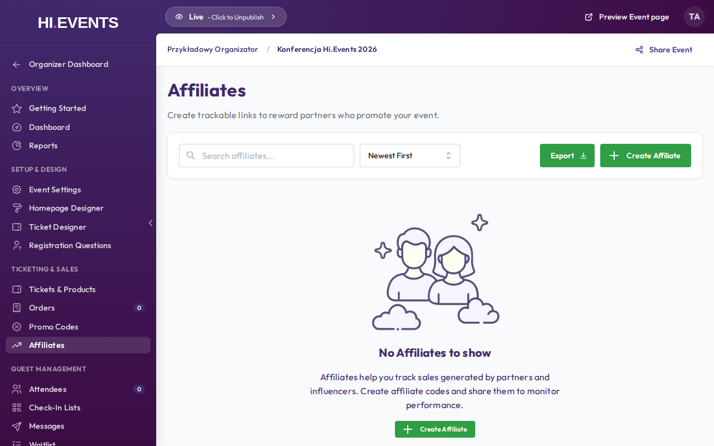

Kliknij **+ Create**, aby stworzyć link afiliacyjny.

| Pole | Opis |
|------|------|
| **Name** | Nazwa partnera / influencera |
| **Code** | Unikalny kod (3–20 znaków) lub kliknij „Generate" |
| **Email** | Opcjonalnie – kontakt z partnerem |

System generuje unikalny link do strony wydarzenia z kodem afiliata. Zakupy przez ten link są śledzone w raportach.

---

## 14. Płatności offline i fakturowanie

Ścieżka: **menu boczne → Ustawienia wydarzenia → Płatności i fakturowanie**

### 14.1 Włączanie płatności offline

Płatności offline umożliwiają akceptowanie przelewów bankowych, czeków lub innych metod płatności poza systemem. Uczestnik może złożyć zamówienie i otrzymać bilety – jednak zamówienie będzie oznaczone jako **Awaiting Payment** (oczekuje na zapłatę) aż do ręcznego potwierdzenia.

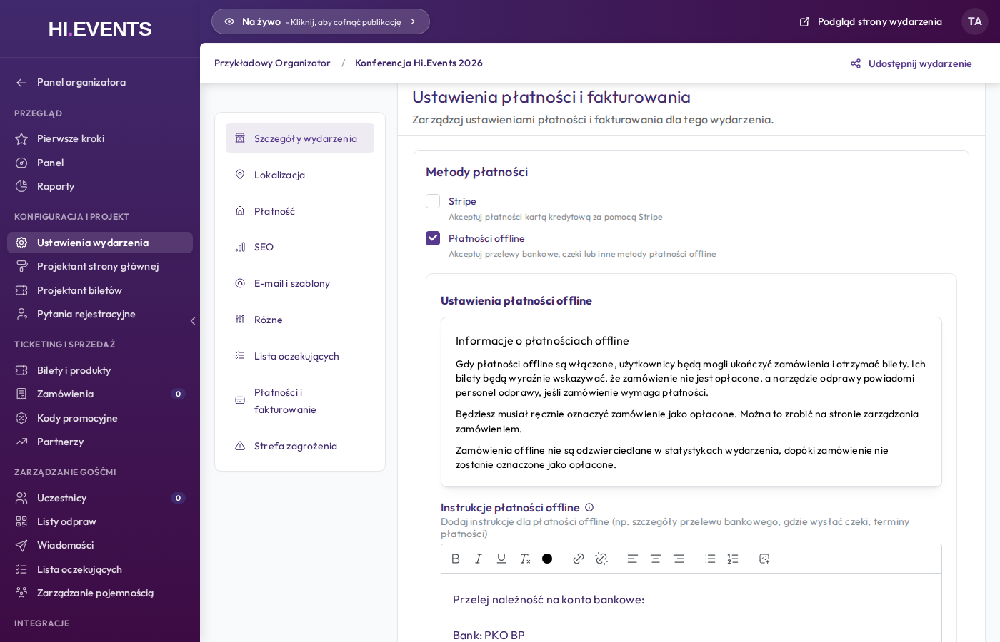

**Kroki:**

1. Przejdź do **Ustawienia wydarzenia → Płatności i fakturowanie**
2. W sekcji **Metody płatności** zaznacz checkbox **Płatności offline**
   - Możesz odznaczyć Stripe, jeśli chcesz przyjmować *wyłącznie* płatności offline
   - Możesz zaznaczyć oba, aby dać kupującemu wybór

> **Ważne:** Zamówienia offline nie są wliczane do statystyk sprzedaży dopóki nie zostaną ręcznie oznaczone jako opłacone.

### 14.2 Instrukcja płatności offline

Po włączeniu płatności offline pojawia się pole **Instrukcja płatności offline**, które będzie wyświetlane kupującemu na stronie potwierdzenia zamówienia oraz w e-mailu.

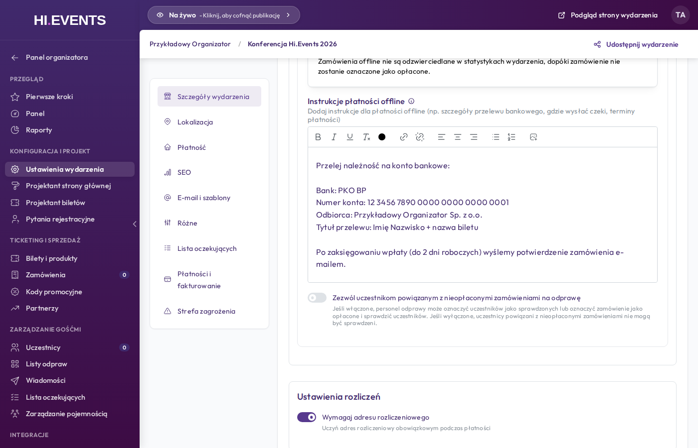

Wpisz dane do przelewu, np.:

```
Bank: PKO BP
Numer konta: 12 3456 7890 0000 0000 0000 0001
Odbiorca: Przykładowy Organizator Sp. z o.o.
Tytuł przelewu: Imię Nazwisko + nazwa biletu

Po zaksięgowaniu wpłaty (do 2 dni roboczych) wyślemy potwierdzenie zamówienia e-mailem.
```

Opcjonalnie zaznacz **Zezwól uczestnikom oczekującym na płatność offline na odprawnę** – wtedy obsługa przy wejściu będzie widzieć ostrzeżenie, ale może wpuścić uczestnika.

Kliknij **Zapisz**, aby zastosować zmiany.

### 14.3 Ręczne potwierdzenie płatności

Po otrzymaniu przelewu przejdź do zamówienia:
1. **menu boczne → Zamówienia**
2. Kliknij w zamówienie ze statusem **Awaiting Payment**
3. W bocznym panelu wybierz zakładkę **Edit**
4. Zmień status na **Paid** i zapisz

### 14.4 Włączanie fakturowania


W tej samej sekcji **Ustawienia faktury**:

| Pole | Opis |
|------|------|
| **Włącz fakturowanie** | Przełącznik – faktury będą dołączane do e-maili z potwierdzeniem |
| **Etykieta dokumentu** | Domyślnie „Faktura VAT" – pojawia się w nagłówku faktury |
| **Prefiks numeru** | Np. `FV-2026` – prefix przed numerem (tylko litery, cyfry, myślniki) |
| **Pierwszy numer faktury** | Numer startowy – nie można zmienić po wystawieniu pierwszej faktury |
| **Okres płatności** | Liczba dni na zapłatę (widoczna w warunkach na fakturze) |
| **Nazwa organizacji** | Wymagana – pojawia się na fakturze (wymagane przy włączonym fakturowaniu) |
| **Adres organizacji** | Wymagany – adres firmy na fakturze |
| **Dane podatkowe** | NIP, REGON – wyświetlane w stopce faktury |
| **Uwagi na fakturze** | Opcjonalne informacje dodatkowe |

> **Wskazówka:** Przy włączonym fakturowaniu zaleca się też włączenie opcji **Wymagaj adresu rozliczeniowego**, aby kupujący podawał dane do faktury podczas zakupu.

Kliknij **Zapisz**, aby zapisać konfigurację fakturowania.

---

## Szybkie odnośniki

| Strona | URL |
|--------|-----|
| Logowanie | https://localhost:8443/auth/login |
| Dashboard | https://localhost:8443/manage/events |
| Twoje wydarzenie | https://localhost:8443/manage/event/1/getting-started |
| Tickets & Products | https://localhost:8443/manage/event/1/products |
| Zamówienia | https://localhost:8443/manage/event/1/orders |
| Ustawienia konta | https://localhost:8443/manage/account/ |
| Strona publiczna | https://localhost:8443/e/1/konferencja-hievents-2026 |
| Mailpit (poczta) | http://localhost:8025 |
